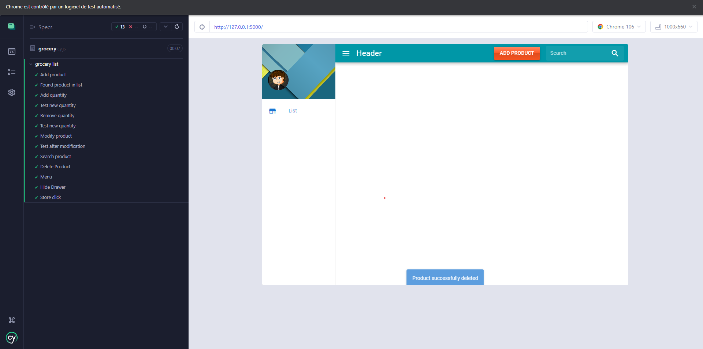

# grocery-list

## Fait par : 
Kozlov Antoine  
Pochet Antoine  
Michot Julien  
Raya Hassan  

## Dependencies

Flask dependency is used in this project, if you don't have it run this :

```
pip install flask
pip install pytest
pip install mutmut #mutation testing
```

## Start command

To start the project, run this command :

```
python3 init_db.py reset_db
python3 app.py
```

To run tests, execute this command from root :

```
pytest
mutmut run #Run mutation testing
mutmut html #Export Result into html/ folder
```

To run Cypress test, execute this command from root:

```
# install packages
npm install

# init db test
python3 init_db.py reset_db True

# run application at test profile
python3 app.py test

# open project in cypress and start tests
npx cypress run
```

```
(Results)

  ┌────────────────────────────────────────────────────────────────────────────────────────────────┐
  │ Tests:        13                                                                               │
  │ Passing:      13                                                                               │
  │ Failing:      0                                                                                │
  │ Pending:      0                                                                                │
  │ Skipped:      0                                                                                │
  │ Screenshots:  0                                                                                │
  │ Video:        true                                                                             │
  │ Duration:     9 seconds                                                                        │
  │ Spec Ran:     grocery.cy.js                                                                    │
  └────────────────────────────────────────────────────────────────────────────────────────────────┘


====================================================================================================

  (Run Finished)


       Spec                                              Tests  Passing  Failing  Pending  Skipped
  ┌────────────────────────────────────────────────────────────────────────────────────────────────┐
  │ √  grocery.cy.js                            00:09       13       13        -        -        - │
  └────────────────────────────────────────────────────────────────────────────────────────────────┘
    √  All specs passed!                        00:09       13       13        -        -        -

```

> 

## Report

You can find our testing report [here](Report.md).
