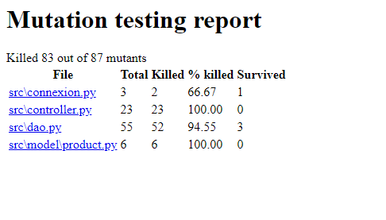
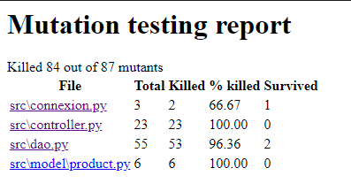

*Lorsque vous rencontrez une flèche comme celle-ci ▶ cliquez pour afficher le code*
# Testing decisions

## Non tested code, why ?

### Front

Nous n'avons pas testé le front qui est en VueJS car cela demandait d'apprendre une nouvelle manière de tester qui
aurait été couteuse en temps et nous avons préféré nous focaliser sur les units tests et les functional tests. 
Cependant, avec plus de temps, nous aurions réalisé les tests du front grâce à l'outil de test Jest.

### Mutation testing

L'exécution de mutation testing a retourné un cas d'erreur en modifiant la méthode `get_db_connection` présente dans
`src/connexion.py`. La méthode contient un `print` de l'erreur de `sqlite3.error`. Mutation testing va remplacer 
l'erreur par un None et cela va générer un mutant non tué. Nous avons décidé de ne pas tester cette fonction, car il 
s'agirait de tester un cas d'erreur et le test porterait sur la méthode print qui est native à python et non pas écrite 
par nous.

> Ci-dessous, il y a la trace de l'exécution de mutation testing sur `get_db_connection`

```text
--- src\connexion.py
+++ src\connexion.py
@@ -8,5 +8,5 @@
         conn = sqlite3.connect(path)
         conn.row_factory = sqlite3.Row
     except sqlite3.error as e:
-        print(e)
+        print(None)
     return conn
```

> Ci-dessous, la méthode en question

```python
def get_db_connection(test=False): # pragma: no mutate
    path = 'database.db' # pragma: no mutate
    if test:
        path = 'databasetest.db' # pragma: no mutate
    try:
        conn = sqlite3.connect(path)
        conn.row_factory = sqlite3.Row
    except sqlite3.error as e:
        print(e)
    return conn
```

## What has been tested and why

Pour la réalisation des tests, afin de ne pas interférer avec l'application, nous avons mis en place une base de données
dédiée aux tests. Pour l'utiliser, nous avons une variable `test` qui est un booléen. Elle permet lors de 
l'initialisation et lors du reset de la base de donnée de choisir la base de donnée de test.

### Unit tests 

Des tests unitaires ont été réalisés sur ce projet, nous avons testé :

- le dao

Pour ce faire, nous avons testé les méthodes suivantes en vérifiant que par exemple l'insertion se fasse bien mais aussi
qu'elle échoue bien et renvoie le bon code d'erreur lorsqu'un appel est mal réalisé.

<details>
<summary><b>add_product & update_product</b></summary>

```python
def test_insert_success(self):
    dao = self.init_dao()
    product = Product(None, self.test_quantity, self.test_name)
    dao.add_product(product)

    rows = self.get_rows()
    assert rows[0]['id'] == 1
    assert rows[0]['quantity'] == self.test_quantity
    assert rows[0]['name'] == self.test_name
    
# ===================================================== #    

def test_insert_failed_str(self):
    dao = self.init_dao()
    product = Product(None, "not a int", self.test_name)
    with pytest.raises(QuantityException):
        dao.add_product(product)

    rows = self.get_rows()
    assert len(rows) == 0
    
# ===================================================== #

def test_insert_failed_quantity_none(self):
    dao = self.init_dao()
    product = Product(None, None, self.test_name)
    with pytest.raises(QuantityException):
        dao.add_product(product)

    rows = self.get_rows()
    assert len(rows) == 0
    
# ===================================================== #

def test_insert_failed_name_none(self):
    dao = self.init_dao()
    product = Product(None, self.test_quantity, None)
    with pytest.raises(NameException):
        dao.add_product(product)

    rows = self.get_rows()
    assert len(rows) == 0
    
# ===================================================== #

def test_insert_failed_id_not_none(self):
    dao = self.init_dao()
    product = Product(21, self.test_quantity, self.test_name)
    with pytest.raises(IdException):
        dao.add_product(product)

    rows = self.get_rows()
    assert len(rows) == 0
```
</details>

<details>
<summary><b>get_product_by_id & get_product_by_name & get_all_product</b></summary>

```python
def test_get_product_by_id_success(self):
    dao = self.init_dao()
    self.add_test_product()
    product = dao.get_product_by_id(self.test_id)
    assert product.id == self.test_id
    assert product.quantity == self.test_quantity
    assert product.name == self.test_name
    
# ===================================================== #

def test_get_product_by_id_failed_wrong_id(self):
    dao = self.init_dao()
    self.add_test_product()
    product = dao.get_product_by_id(2)
    assert product is None
    
# ===================================================== #

def test_get_product_by_id_failed_none_id(self):
    dao = self.init_dao()
    self.add_test_product()
    with pytest.raises(IdException):
        dao.get_product_by_id(None)

# ===================================================== #
        
def test_get_product_by_id_failed_str_id(self):
    dao = self.init_dao()
    self.add_test_product()
    with pytest.raises(IdException):
        dao.get_product_by_id("not id")
```

</details>

- l'initialisation de la db

Au premier lancement du projet, nous initialisons la base de données à l'aide d'une fonction que nous avons réalisé,
nous avons donc fait un test unitaire pour nous assurer de son bon fonctionnement.
On va alors vérifier que la longueur des éléments dans la base de données est vide.

<details>
<summary><b>reset_db</b></summary>

```python
def test_reset_db(self):
    init_db.reset_db(True)
    conn = get_db_connection(True)
    things = conn.execute("""Select * from Products""").fetchall()
    things = [tuple(row) for row in things]
    assert len(things) == 0
```
</details>

### Functional tests

Nous avons réalisé des tests fonctionnels pour ce projet, ils se basent sur la vérification du fonctionnement des 
routes.

Tous les endpoints ont alors été testés.
Les cas de succès ou d'échecs sont testés tout comme pour les unit tests. Ici nous vérifions que la donnée est bonne,
mais également que le code de retour est bien celui attendu.

Pour ces tests nous utilisons une méthode qui se lance avant et après chacun des tests :

```python
@pytest.fixture(autouse=True)
def run_before_and_after_tests(self):
    init_db.reset_db(True)
    app = Flask(__name__, template_folder='../../templates')
    app.config.update({
        "TESTING": True,
    })
    controller.configure_routes(app, True)
    client = app.test_client()
    dao = Dao(test=True)
    dao.add_product(Product(None, 3, "TestName"))
    self.client = client
```

<details>
<summary><b>index (base route)</b></summary>

```python
def test_base_route(self):
    url = '/'
    response = self.client.get(url)
    self.client.delete()
    assert response.status_code == 200

# ===================================================== #

def test_wrong_url(self):
    response = self.client.get('/bad/url')
    assert response.status_code == 404
```

</details>

<details>
<summary><b>add_product</b></summary>

```python
def test_add_ok(self):
    get_all = self.client.get('/product')
    assert get_all.status_code == 200
    assert get_all.data == b'[{"id":1,"name":"TestName","quantity":3}]\n'

    url = '/product'
    dict = {'name': 'Test', 'quantity': 8}
    response = self.client.post(url, data=json.dumps(dict), content_type='application/json')
    assert response.status_code == 200

    get_all = self.client.get('/product')
    assert get_all.status_code == 200
    assert get_all.data == b'[{"id":1,"name":"TestName","quantity":3},{"id":2,"name":"Test","quantity":8}]\n'

# =====================================================#

def test_add_if_conflict(self):
    get_all = self.client.get('/product')
    assert get_all.status_code == 200
    assert get_all.data == b'[{"id":1,"name":"TestName","quantity":3}]\n'

    url = '/product'
    dict = {'name': 'TestName', 'quantity': 8}
    response = self.client.post(url, data=json.dumps(dict), content_type='application/json')
    assert response.status_code == 409
    assert str(response.text) == NAME_CONFLICT

    get_all = self.client.get('/product')
    assert get_all.status_code == 200
    assert get_all.data == b'[{"id":1,"name":"TestName","quantity":3}]\n'
```

</details>

<details>
<summary><b>modify_product</b></summary>

```python
def test_modify_quantity_success(self):
    url = '/product/1'
    dict = {'name': 'NewName', 'quantity': 8}
    response = self.client.put(url, data=json.dumps(dict), content_type='application/json')
    assert response.status_code == 200

    get_all = self.client.get('/product')
    assert get_all.status_code == 200
    assert get_all.data == b'[{"id":1,"name":"NewName","quantity":8}]\n'

# =====================================================#

def test_modify_failure_id_not_integer(self):

    get_all = self.client.get('/product')
    assert get_all.status_code == 200
    assert get_all.data == b'[{"id":1,"name":"TestName","quantity":3}]\n'

    url = '/product/NotId'
    dict = {'name': 'TestName', 'quantity': 8}
    response = self.client.put(url, data=json.dumps(dict), content_type='application/json')
    assert response.status_code == 400
    assert str(response.text) == ID_NOT_INT

    get_all = self.client.get('/product')
    assert get_all.status_code == 200
    assert get_all.data == b'[{"id":1,"name":"TestName","quantity":3}]\n'

def test_modify_failure_id_not_exist(self):

    get_all = self.client.get('/product')
    assert get_all.status_code == 200
    assert get_all.data == b'[{"id":1,"name":"TestName","quantity":3}]\n'

    url = '/product/125656'
    dict = {'name': 'TestName', 'quantity': 8}
    response = self.client.put(url, data=json.dumps(dict), content_type='application/json')
    assert response.status_code == 404
    assert str(response.text) == PRODUCT_NOT_FOUND

    get_all = self.client.get('/product')
    assert get_all.status_code == 200
    assert get_all.data == b'[{"id":1,"name":"TestName","quantity":3}]\n'

# =====================================================#

def test_modify_failure_quantity(self):

    url = '/product/1'
    dict = {'name': 'TestName', 'quantity': 0}
    response = self.client.put(url, data=json.dumps(dict), content_type='application/json')
    assert response.status_code == 400
    assert str(response.text) == QUANTITY_LOWER_THAN_ONE

    get_all = self.client.get('/product')
    assert get_all.status_code == 200
    assert get_all.data == b'[{"id":1,"name":"TestName","quantity":3}]\n'

def test_modify_failure_quantity_negative(self):
    url = '/product/1'
    dict = {'name': 'TestName', 'quantity': -50}
    response = self.client.put(url, data=json.dumps(dict), content_type='application/json')
    assert response.status_code == 400
    assert str(response.text) == QUANTITY_LOWER_THAN_ONE

    get_all = self.client.get('/product')
    assert get_all.status_code == 200
    assert get_all.data == b'[{"id":1,"name":"TestName","quantity":3}]\n'

def test_modify_failure_quantity_null(self):
    url = '/product/1'
    dict = {'name': 'TestName'}
    response = self.client.put(url, data=json.dumps(dict), content_type='application/json')
    assert response.status_code == 400
    assert str(response.text) == MISSING_ARGUMENTS

    get_all = self.client.get('/product')
    assert get_all.status_code == 200
    assert get_all.data == b'[{"id":1,"name":"TestName","quantity":3}]\n'

    # =====================================================#

def test_modify_if_conflict(self):
    dao = Dao(test=True)
    dao.add_product(Product(None, 3, "Test"))
    get_all = self.client.get('/product')
    assert get_all.status_code == 200
    assert get_all.data == b'[{"id":1,"name":"TestName","quantity":3},{"id":2,"name":"Test","quantity":3}]\n'

    url = '/product/1'
    dict = {'name': 'Test', 'quantity': 8}
    response = self.client.put(url, data=json.dumps(dict), content_type='application/json')
    assert response.status_code == 409
    assert str(response.text) == NAME_CONFLICT

    get_all = self.client.get('/product')
    assert get_all.status_code == 200
    assert get_all.data == b'[{"id":1,"name":"TestName","quantity":3},{"id":2,"name":"Test","quantity":3}]\n'
```

</details>

<details>
<summary><b>get_all</b></summary>

```python
def test_get_all(self):
    get_all = self.client.get('/product')
    assert get_all.status_code == 200
    assert get_all.data == b'[{"id":1,"name":"TestName","quantity":3}]\n'
```

</details>

<details>
<summary><b>delete_product</b></summary>

```python
def test_delete_failure_id_not_integer(self):
    get_all = self.client.get('/product')
    assert get_all.status_code == 200
    assert get_all.data == b'[{"id":1,"name":"TestName","quantity":3}]\n'

    url = '/product/NotId'
    response = self.client.delete(url)
    assert response.status_code == 400
    assert str(response.text) == ID_NOT_INT

    get_all = self.client.get('/product')
    assert get_all.status_code == 200
    assert get_all.data == b'[{"id":1,"name":"TestName","quantity":3}]\n'

def test_delete_failure_id_not_exist(self):
    get_all = self.client.get('/product')
    assert get_all.status_code == 200
    assert get_all.data == b'[{"id":1,"name":"TestName","quantity":3}]\n'

    url = '/product/125656'
    response = self.client.delete(url)
    assert response.status_code == 404
    assert str(response.text) == PRODUCT_NOT_FOUND

    get_all = self.client.get('/product')
    assert get_all.status_code == 200
    assert get_all.data == b'[{"id":1,"name":"TestName","quantity":3}]\n'

# =====================================================#

def test_delete_success(self):

    get_all = self.client.get('/product')
    assert get_all.status_code == 200
    assert get_all.data == b'[{"id":1,"name":"TestName","quantity":3}]\n'

    url = '/product/1'
    response = self.client.delete(url)
    assert response.status_code == 200

    get_all = self.client.get('/product')
    assert get_all.status_code == 200
    assert get_all.data == b'[]\n'
```

</details>

## Advanced techniques used

### Mutation testing

Nous avons choisi d'utiliser mutation testing sur notre programme python afin de découvrir des bugs que l'on n'aurait 
pas trouvés autrement. Il va permettre de tester nos tests en faisant muter nos classes. Si les classes mutantes 
survivent, c'est-à-dire qu'elles ne se font pas arrêter par nos tests, des tests sont manquants. Avec les retours de
l'exécution de mutation testing, nous pouvons créer des cas de tests pour les classes mutantes qui n'ont pas été tuées.


Cela a pour finalité d'augmenter le test coverage de notre code puisque l'on a pu créer de nouveaux cas de tests. 

> Exécution de mutation testing a généré 87 mutants, suite à cela 83 mutants ont été tués et 4 ont survécu



Un exemple de mutant non tué qui nous a permis de créer un nouveau cas de test :

L'exécution de mutation testing a révélé un mutant non tué au niveau de la fonction `check_product_name`. Il va modifier
la condition présente dans la méthode en remplaçant un `or` en `and`. Ici le mutant a résisté aux tests puisqu'il n'y en
avait pas, cette fonction n'avait pas été testée. Pour remédier à cela, on a testé les deux cas de la condition.

> Ci-dessous, la trace de l'exécution de mutation testing sur `check_product_name`

```text
--- src\dao.py
+++ src\dao.py
@@ -29,7 +29,7 @@
 
 # Check name method for potential errors
 def check_product_name(product_name):
-    if product_name is None or type(product_name) is not str:
+    if product_name is None and type(product_name) is not str:
         raise NameException(NAME_NOT_STRING)
```

> Ci-dessous, la méthode en question 

```python
# Check name method for potential errors
def check_product_name(product_name):
    if product_name is None or type(product_name) is not str:
        raise NameException(NAME_NOT_STRING)
```

> Ci-dessous, les tests qui ont permis de ne pas retrouver le mutant

```python
def test_check_product_name_failed_none(self):
    with pytest.raises(NameException):
        check_product_name(None)

def test_check_product_name_failed_int_type(self):
    with pytest.raises(NameException):
        check_product_name(1)
```

> Nouvelle exécution de mutation testing après l'ajout des tests

